# TetrisBattle Bot

Телеграм‑бот для визуализации механик Тетриса и демонстрации пошаговых команд через конечный автомат. Бот умеет выводить правила, рисовать текстовое поле, показывать случайную фигуру и в пошаговом режиме строить поле заданного размера.

---

## Возможности

- `/rules` — вывести краткие правила.
- `/field` — показать пустое поле 20×10.
- `/next_tetramino` — показать случайную фигуру (I, O, T, S, Z, J, L) с ASCII‑превью.
- `/custom_field` — **пошаговая команда (FSM)**: бот спросит количество строк → затем столбцов и построит поле.
- `/cancel` — отмена текущей пошаговой операции и сброс состояния.
- `/help` — список команд.

> Требование «пошаговые команды реализованы с помощью конечного автомата» — выполнено: диалог ведётся через состояния `IDLE → AWAIT_ROWS → AWAIT_COLS → IDLE`.

---

## Технологии

- **Node.js** (ES‑modules)
- **node-telegram-bot-api** — интеграция с Telegram
- **dotenv** — чтение переменных окружения из `.env`
- **Jest** — модульные тесты утилит (coverage)
- **ESLint** — проверка качества кода

*(В проекте не используется Express, так как бот работает в режиме long polling и не поднимает HTTP‑сервер.)*

---

## Структура проекта

```
project/
├─ src/
│  ├─ index.js            # точка входа (runServer())
│  ├─ server.js           # логика бота
│  └─ utils/
│     ├─ field.js         # renderEmptyField(rows, cols, cell)
│     ├─ tetromino.js     # TETROMINOES, randomTetromino(rng)
│     ├─ rules.js         # RULES_TEXT
│     └─ index.js         # «баррель» экспортов
├─ tests/
│  ├─ field.test.js
│  └─ tetromino.test.js
├─ images/                # скриншоты работы бота (1.jpg … 13.jpg)
├─ .env.example           # образец окружения
├─ .gitignore
├─ eslint.config.js
├─ jest.config.json
├─ package.json
└─ README.md
```

---

## Подготовка и запуск

1) **Установить зависимости**
```bash
npm install
```

2) **Создать файл `.env`** в корне (см. `.env.example`):
```env
TELEGRAM_BOT_TOKEN=ваш_токен_бота
```

3) **Запустить бота**
```bash
npm start
```
Бот перейдёт в режим long polling и будет готов принимать команды в Telegram.

> Остановить: `Ctrl + C` в терминале.

Для разработки с авто‑перезапуском:
```bash
npm run dev
```

---

## Скрипты

```json
{
  "start": "node ./src/index.js",
  "dev": "nodemon ./src/index.js",
  "test": "cross-env NODE_OPTIONS=--experimental-vm-modules jest --passWithNoTests",
  "test:coverage": "cross-env NODE_OPTIONS=--experimental-vm-modules jest --coverage",
  "lint": "eslint .",
  "lint:fix": "eslint . --fix"
}
```

---

## Тестирование и покрытие

Запуск тестов:
```bash
npm test
```

Отчёт покрытия (coverage):
```bash
npm run test:coverage
```

### Coverage threshold
В проекте настроен порог покрытия (coverage threshold). Все метрики (строки, функции, выражения и ветви) должны быть **не ниже порога**, иначе тестовый прогон завершится с ошибкой. Утилиты `field.js` и `tetromino.js` покрыты тестами на 100% по всем метрикам.

---

## Конечный автомат (FSM) для пошаговой команды

Пошаговая команда `/custom_field` реализована через простейший FSM c хранением состояния в памяти процесса (Map):

- **Состояния**: `IDLE`, `AWAIT_ROWS`, `AWAIT_COLS`.
- **Переходы**: `/custom_field` → `AWAIT_ROWS` → `AWAIT_COLS` → построение поля → `IDLE`.
- **Отмена**: `/cancel` — сбрасывает состояние и завершает сценарий.
- **TTL**: сессия автоматически очищается, если пользователь «завис» на шаге длительное время.
- **Валидация**: ввод строк/столбцов проверяется на целочисленность и диапазон (совпадает с валидацией в утилите).

> Состояние изолировано по чату: параллельные пользователи в разных чатах не пересекают сценарии.

---

## Примеры работы

> Скриншоты находятся в папке `images/`.

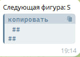
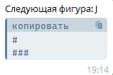
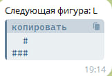
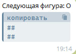
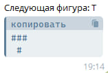
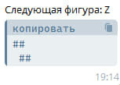
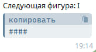

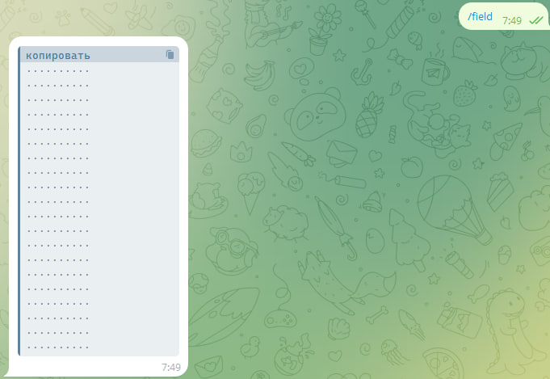
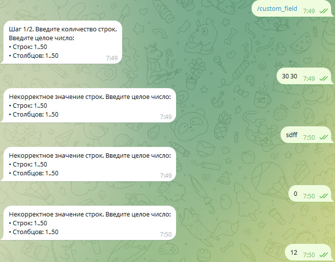
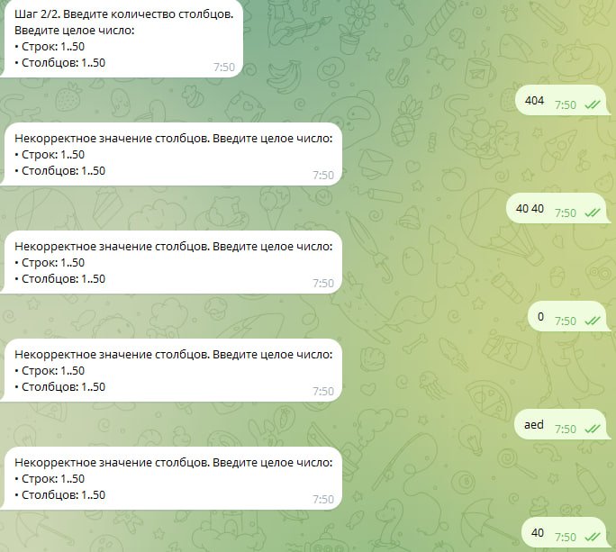
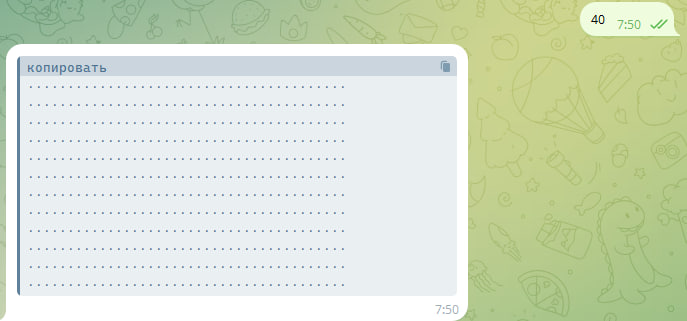
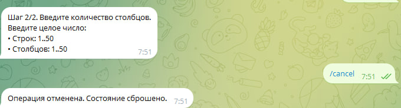
