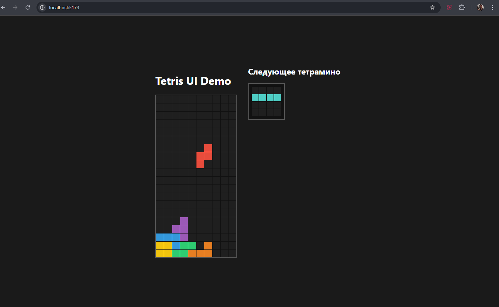

# Lab 5

## Данный проект является выполнением лабораторной работы №5 по предмету JS.
### Лабораторная состоит из двух отдельных проектов:

- ui-library — библиотека UI-компонентов

- frontend — демонстрационное приложение, которое показывает работу компонентов

Компоненты реализованы без сторонних UI-фреймворков и написаны на TypeScript + React

## UI-Library
Библиотека содержит два компонента, которые требуются по заданию:

1. Glass

Компонент отображает «стакан» Тетриса — двумерное поле с расставленными фигурами.

✔ Функциональные требования выполнены:

- компонент принимает двумерный массив чисел

- каждое число отвечает за цвет ячейки

- компонент имеет дефолтные параметры размера (10×20)

- компонент отображает сетку с раскрашенными клетками

2. NextTetromino

Компонент отображает «следующую фигуру» в Тетрисе.

✔ Функциональные требования выполнены:

- принимает объект тетрамино:

- локальные координаты ячеек

- цвет фигуры

- корректно центрирует фигуру внутри сетки 4×4

- отображает только указанные координаты

## Frontend
Приложение показывает примеры использования обоих компонентов из ui-library.

Функциональность:

✔ отображение нескольких тетрамино

✔ отображение заполненного стакана

✔ использование собственной UI-библиотеки

## Инструкция по запуску

**UI-Library:**
```bash
cd ui-library
npm install
npm run build
npm run test
npm run test:coverage
npm run lint
```

**Frontend:**
```bash
cd ../frontend
npm install
npm run build
npm run test
npm run test:coverage
npm run lint
npm run dev
```

**Открой в браузере:** http://localhost:5173

## Скриншоты

**Главный экран frontend:**
